# 🔍预览：

# 📝项目介绍

# 
证件照伴侣 V2

让大家久等了，V2版本终于和大家见面了！

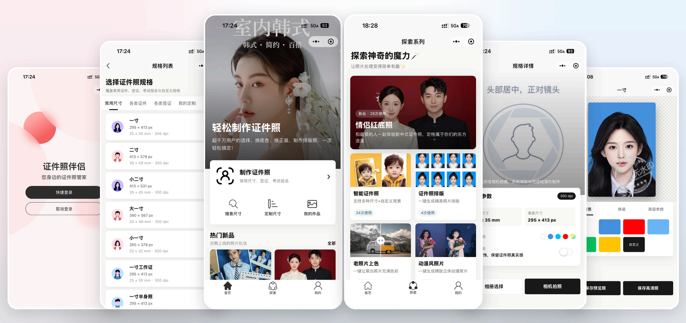

**相关项目**：

- 小程序前端V2第一套：https://github.com/no1yu/photoOneV2
- 小程序管理员网页后台V2：https://github.com/no1yu/zjzAdminV2
- HivisionIDPhotos：https://github.com/Zeyi-Lin/HivisionIDPhotos
- HivisionIDPhotosPro：https://github.com/no1yu/HivisionIDPhotosPro

 

# ⭐最近更新

- 2026.09.01：V2版本正式发布

 

#  📦私有化部署API接口说明

本项目的所有功能都是基于HivisionIDPhotos Pro进行对接开发，您部署HivisionIDPhotos Pro后即可完成私有化部署API

1.视频部署教程：待添加

2.如果您不想部署，可以使用映象引擎云平台：https://cloud.0po.cn/

 

# 🤩功能

##### 现有功能：

- 无需单独购买API
- 本地0成本处理
- 无限免费调用API
- 自带700+尺寸
- 支持换装
- 支持水印
- 支持美颜
- 支持流量主
- 支持鉴黄
- 支持微信支付
- 支持自定义尺寸
- 支持自定义更换背景色
- 支持普通下载和高清下载
- 支持引导用户打开保存相册
- 支持相机拍摄和相册选择
- 支持管理员网页后台
- 社交媒体模板照
- 模糊图片变清晰
- 黑白图片上色
- 图片格式转换
- 动漫风照片
- 图片加水印
- 美式证件照
- 情侣红底照
- 证件照排版
- 智能抠图
- 图片压缩
- 无感登录

 

##### 隐私安全：
- 每天自动清理超过 7 天且从未解锁的照片数据和物理图片
- 每 30 分钟清理过期的临时编辑数据和临时目录

 

# 🔧部署

视频教程：待添加（建议都先看一遍）

环境工作准备：

1. 
- jdk=1.8
- mysql=8.0或5.7
- redis=7.2.4或任意版本

2. 
- Mysql导入1.sql
- 打开web_set表，配置app_id，app_secret
- 至此Mysql配置完毕

3.
- IDEA导入项目 
- 打开application.yml
- 按下图进行一步步配置

##### 修改Redis：

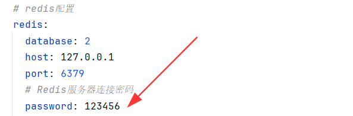

##### 修改Mysql：

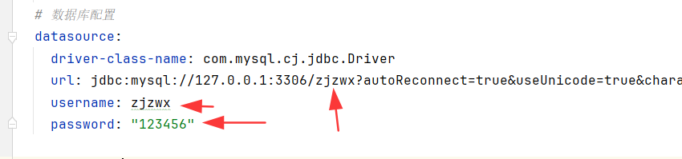

 

# ⚡️注意
1. 小程序提交到体验版后，需要配置你的微信安全域名（也叫服务器域名）如图，JAVA后端域名+图片存储服务器域名 

 

 

# 📧其它
您可以通过以下方式联系我:
 

QQ: 24677102

微信：webxuan

QQ群：151601935

 

# 感谢

感谢 [林博士](https://github.com/Zeyi-Lin) 开源 [HivisionIDPhotos](https://github.com/Zeyi-Lin/HivisionIDPhotos)，让这个项目有了很好的起点

也谢谢所有在 V1 版本中，支持过我的小伙伴们，在我负债的时候是你们拉了我一把，也让我有了继续把项目做下去的动力

<strong>真的很感谢你们</strong>

  <a href="./assets/support-2024-10.jpg">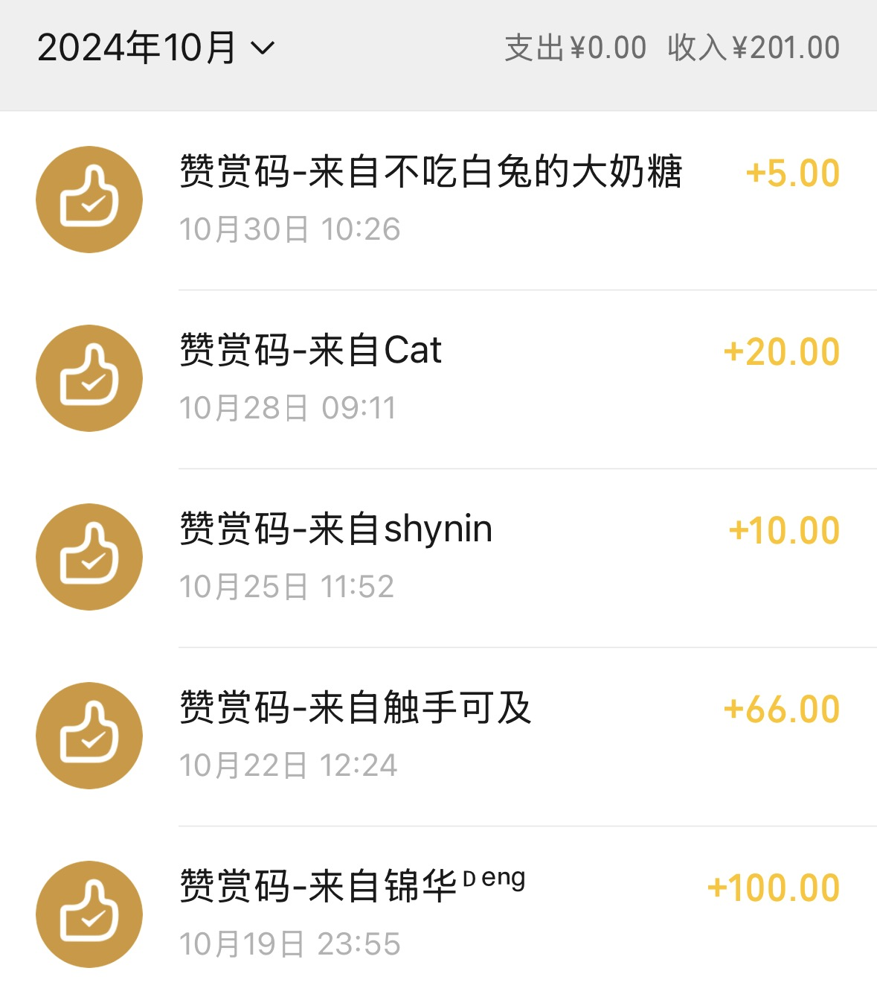</a>
  <a href="./assets/support-2024-11.jpg">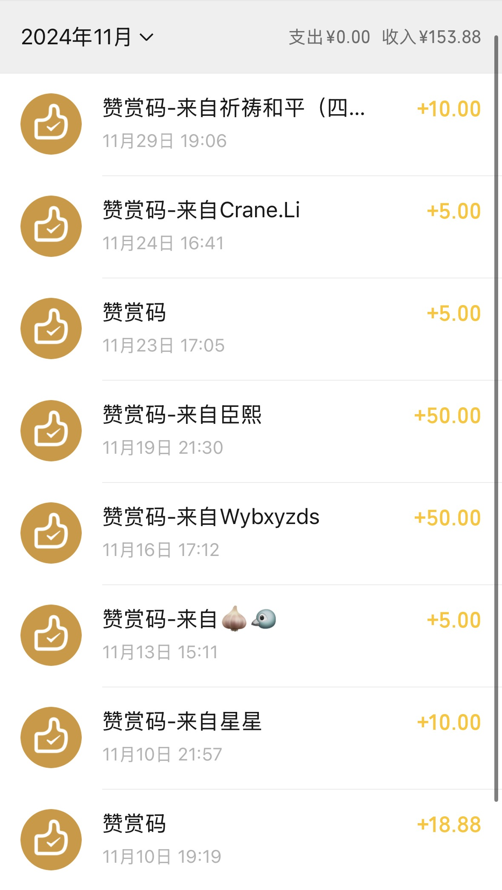</a>
  <a href="./assets/support-2024-12.jpg">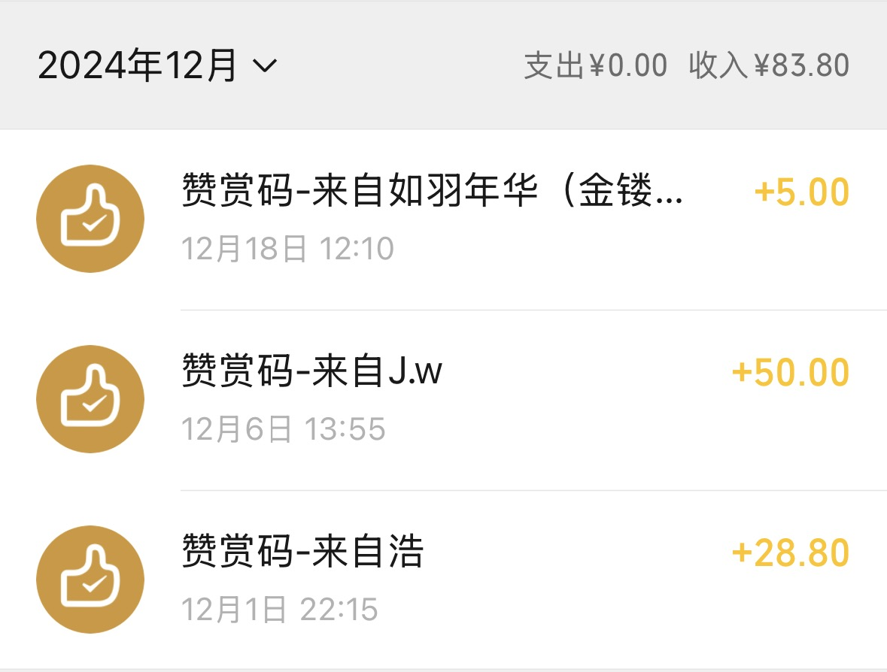</a>

  <a href="./assets/support-2025-01.jpg">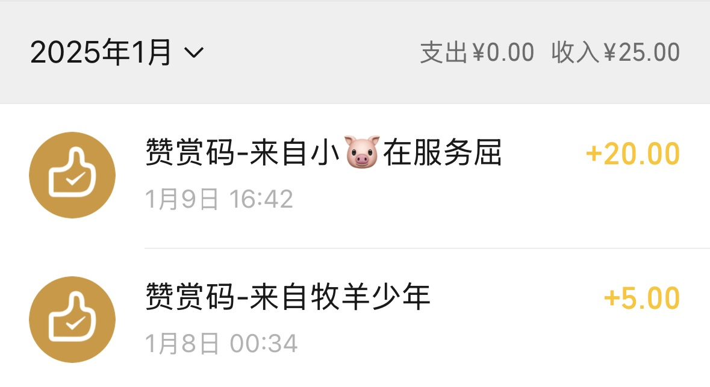</a>
  <a href="./assets/support-2025-02.jpg">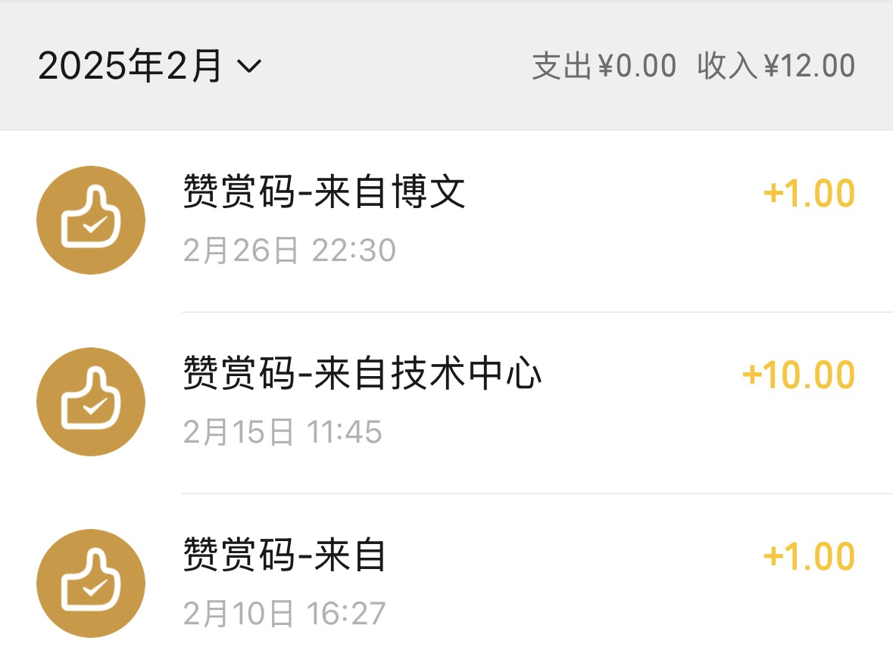</a>
  <a href="./assets/support-2025-03.jpg">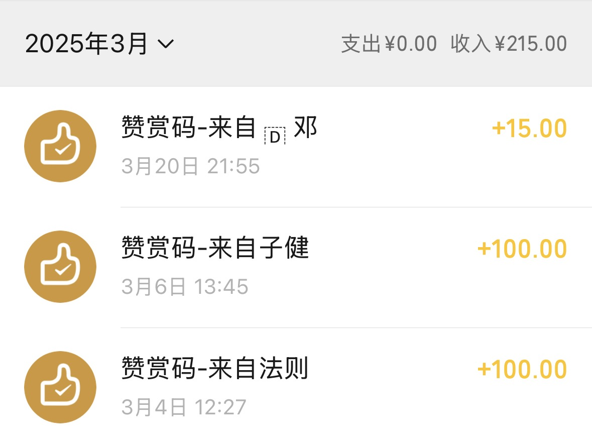</a>

  <a href="./assets/support-2025-05.jpg">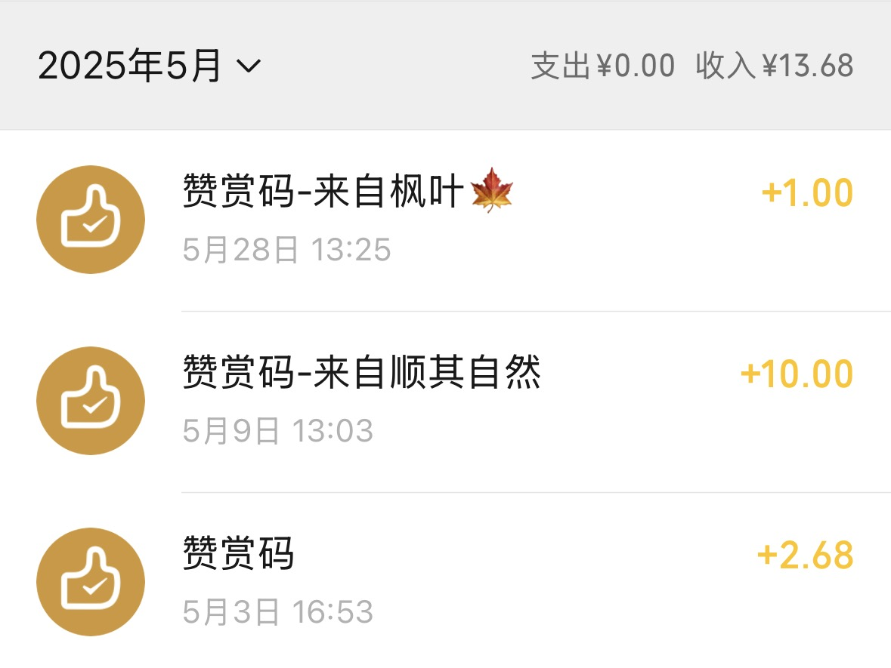</a>
  <a href="./assets/support-2025-08.jpg">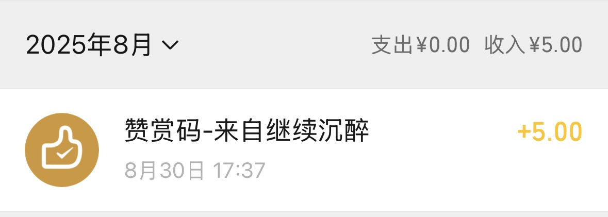</a>
  <a href="./assets/support-2025-09-11.jpg">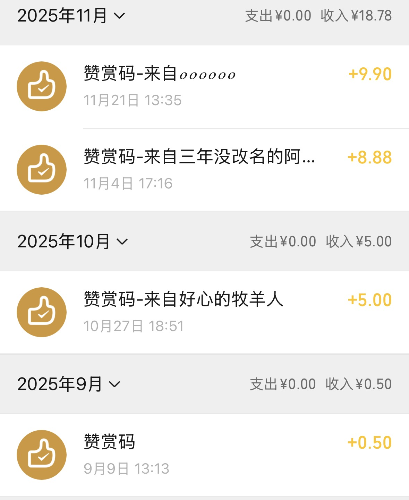</a>

